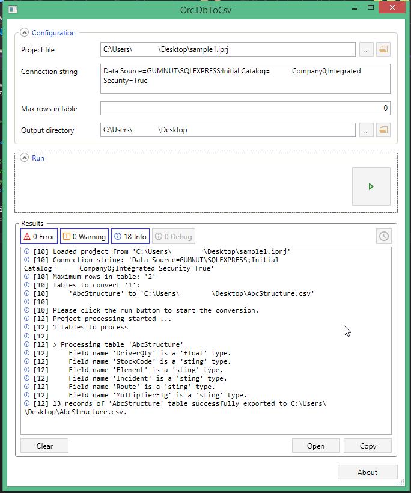

Orc.DbToCsv
===========

[](https://gitter.im/WildGums/Orc.DbToCsv?utm_source=badge&utm_medium=badge&utm_campaign=pr-badge&utm_content=badge)


This library's sole purpose is to extract data from a MS SQL database into csv files. Each table or view will have a corresponding csv file.

The repository contains a library, a command line utility and a task runner

Usage
-------

In order to extract the data the library needs a project file.
A project file is simply an xml file with an ".iprj" extension, and looks like:

```xml
<Project xmlns="http://wildgums/2015">
  <ConnectionString>Data Source=.\SQLExpress;Initial Catalog=MyDbName;Integrated Security=True;Pooling=False</ConnectionString>
  <MaximumRowsInTable>500</MaximumRowsInTable>
  <OutputFolder>C:\Temp\CustomPath</OutputFolder>
  
  <Project.Tables>
    <Table Name="MyTable1"/>
    <Table Name="MyTable2" Csv="Table2.csv"/>
    <Table Name="MyTable3" Csv="Table3.csv" Output="C:\Temp"/>
  </Project.Tables>
</Project>
```

There are four important tags:

- ConnectionString: Standard connection string to connect to the database table.
- MaximumRowsInTable: Will specify the number of rows to retrieve from each table. **If the tag is missing or the value is 0 or less, then all rows will be retrieved.**
- OutputFolder: Specify the folder the files will be saved to. If left blank the files will be created in the direcotry the console or task runner were executed from.
- Tables: Specify the name of each table (or view) you want to extract. If left emtpy, all tables will be extracted.

**Note**: 
- You can specify the csv file name for each table/view using the Csv attribute.
- If the Csv attribute is left blank or does not exist the default file name will be the table name (except white spaces will be replaced with an underscore.)
- You can specify a different output directory for each file. If left blank or does not exist the file will be saved in the "OutputFolder".

Once the project file is setup you can create the csv files using the following command:

```C#
public static void ProcessProject(string projectFilePath, string outputFolderPath, ILogWriter logWriter)
```

Example:

```C#
Importer.ProcessProject(projectFilePath, outputFolderPath, new ConsoleWriter());
```

The parameters are:

- projectFilePath: The path to the .iprj file
- outputFolderPath: The folder path you want to save the csv files to
- logWriter: A log writer object


Command line utility (Orc.DbToCsv.Console)
-------------------------------------------

Orc.DbToCsv.Console is a simple command line utility.

There are two possible command line options:

* -p or -project path to .iprj file. If the option is not defined the utility will try and find a valid project file in the current folder.
* -o or -output path to the output directory where the csv files will be saved to.

Example:

```
Orc.DbToCsv.Console.exe -p E:\sample1.iprj -o D:\output
```

Task Runner
-------------
